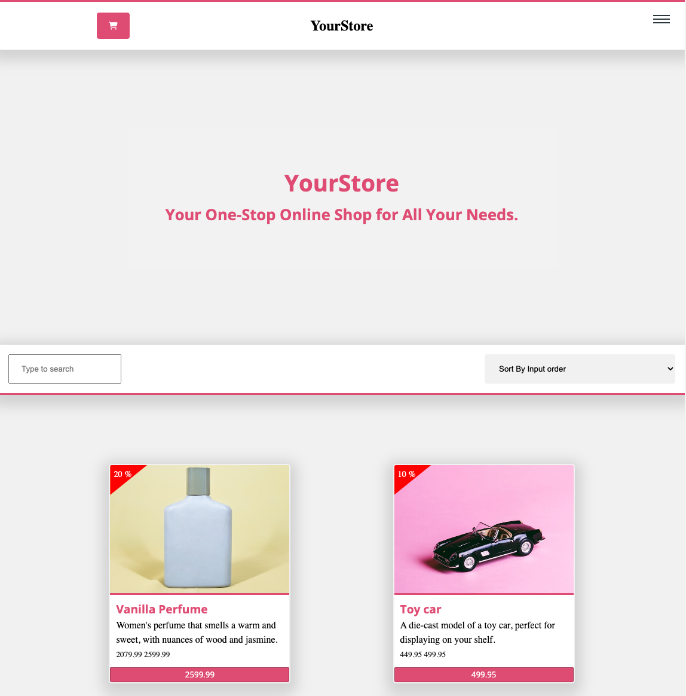

# YourStore


## Description 
YouStore his is e-commerce site build with React. This project has filter for price and cart and checkout function. This was a School project from noroff has a setting for change the company name and slogen and more.  

"Demo Version"
- [Live-Version](https://musical-starship-3a4938.netlify.app/)

## Built With

Here, you can find tech waste used to build this site.

- [React](https://react.dev/)
- [typescript](https://www.typescriptlang.org/)
- [Vite](https://vitejs.dev/)
- [Sass](https://sass-lang.com/)

## Getting Started

   Before installing or building the system, I want to make more defaults like the name of the company and slogan, info, but it's not perfect jet. 

   ### Default Setting 


      You can change the Page name and slogan, but it is not perfect in version 1. In version 2, this will be built more after delivery.

      Inside App.tsx, you can change the name and default name on the page. 

      Example 

      ```
         const pageConfig = [
            {
               CompanyName: 'YourStore',
               CompanySlogen: 'Your One-Stop Online Shop for All Your Needs.',
               email: 'post@yourstore.no',
               telefon: '3322 2222',
               logo: null,
               headerBackgroundImage: null,
            }
         ]
      ```

   ### Installing

   **requirement**  
   -[nodejs](https://nodejs.org/en)

   First thing you need is Clone the Repo

   ```
   git clone git@github.com:nexnic/YourStore.git 
   ```

   ### Getting started

   You can change the code, then need to install node-modules before changing some thing
   
   ```
   npm run update
   ```
   
   **Run Local**

   Run this on your local network.

   ```
   npm run dev   
   ```

   **Sass**

   When changing something inside the sass, You need to run the compiler for sass. 
   ```
   npm run sass
   ```

